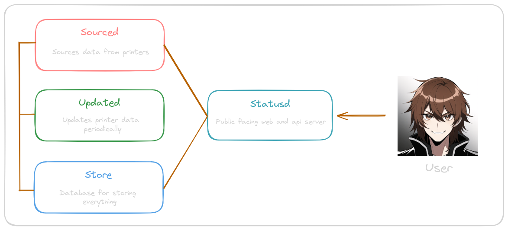

## NYUPrinters

An application to help students find working printers on the NYU campus. This project started out as a way to monitor 
printers at Bobst Library for student staff. Since then, it has since grown into a full-fledged project with the
goal of monitoring printers across NYU.

## Design

The app is designed to be run as containers on docker or pods on kubernetes. It consists of 4 microservices: `sourced`, `statusd`, `updated`, and `store`. 
Each microservice is responsible for various tasks as shown below:

## Features

- Printer Monitoring with real-time status updates
- Multiple Locations including private mode
- Admin dashboard
- Multi-user accounts with different access levels
- Private and Public API
- Smart feedback loop for optimized monitoring (in progress)
- Reports and analytics (in progress)
- Email notifications (in progress)

## Documentation

- [API](./docs/api.md)
- [Development Guide](./docs/dev-guide.md)
- [Sourced](./docs/sourced.md)
- [Statusd](./docs/statusd.md)
- [Updated](./docs/updated.md)
